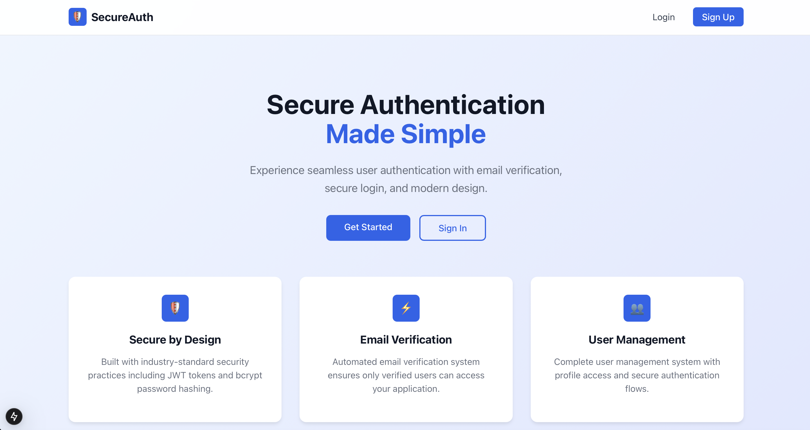

# **Auth Login/Signup with Email Verification (Next.js + MongoDB + Nodemailer)**

## **Table of Contents**

1. [Overview](#overview)  
2. [Concepts Covered](#concepts-covered)  
3. [Learning Objectives](#learning-objectives)  
4. [Technologies Used](#technologies-used)  
5. [Features](#features)  
6. [Setup and Installation](#setup-and-installation)  
   - [Prerequisites](#prerequisites)  
   - [Steps to Run Locally](#steps-to-run-locally)  
7. [Summary](#summary)

---

## **Overview**

This **Auth Login/Signup** system is a **Next.js full-stack** web application with **MongoDB authentication** and **Nodemailer-powered email verification**.  
Users can **sign up, receive a verification code via email, enter the code to verify their account, and then log in securely**.

This app follows **best authentication practices** to prevent fake email registrations, ensuring that only **verified users** can log in.

---

📸 **Screenshot:**



---

## **Concepts Covered**

### **1 - Next.js Full-Stack Authentication**
- Uses **Next.js API Routes** to handle user authentication in a **server-side API**.  
- **Server-side rendering (SSR)** and **client-side navigation** for optimal performance.  

### **2 - Secure Email Verification**
- Users receive a **6-digit verification code** to their email using **Nodemailer**.  
- **Prevents spam** and **fake account registrations**.  

### **3 - JWT Authentication**
- Users receive a **JWT token** after verifying their email.  
- The token is stored securely for **protected routes**.  

### **4 - React State Management**
- **State management with `useState`** for real-time UI updates.  
- **Modal handling** for email verification.  

### **5 - Environment Variables (`.env`)**
- Securely manages **email credentials and database URIs**.  

### **6 - Next.js App Router**
- Uses **Next.js 13+ App Router** for modern routing and layouts.  
- **Server Components** and **Client Components** for optimal performance.  

---

## **Learning Objectives**

- Understand how to build **full-stack authentication** in **Next.js**.  
- Learn **JWT-based authentication** and **secure session management**.  
- Implement **email verification** using **Nodemailer SMTP service**.  
- Use **Next.js API Routes** for backend authentication logic.  
- Handle **protected routes** and **role-based access** for verified users.  
- Master **Next.js App Router** and **Server/Client Components**.  

---

## **Technologies Used**

| Technology       | Purpose                                      |
| ---------------- | -------------------------------------------- |
| **Next.js**      | Full-stack React framework with API routes   |
| **MongoDB**      | Database for storing user credentials        |
| **React**        | Frontend UI for user authentication          |
| **Node.js**      | JavaScript runtime for backend logic         |
| **JWT**          | JSON Web Token for secure authentication     |
| **Nodemailer**   | SMTP service for sending verification emails |
| **dotenv**       | Manages environment variables (.env)         |
| **bcrypt**       | Hashes and secures user passwords            |
| **Tailwind CSS** | Utility-first CSS framework for styling      |

---

## **Features**

✅ **Secure User Signup with Email Verification**  
✅ **6-Digit Code Sent to User's Email (Nodemailer)**  
✅ **Prevents Fake Email Registrations**  
✅ **Only Verified Users Can Log In**  
✅ **JWT Authentication for Secure Sessions**  
✅ **Next.js API Routes for Backend Logic**  
✅ **Modern Next.js App Router Architecture**  
✅ **Server-Side Rendering (SSR) for Performance**  
✅ **Responsive UI with Inline Styling**  
✅ **Protected Dashboard for Verified Users**  
✅ **Error Handling for Invalid Logins or Expired Codes**  
✅ **Full `.env` Config Support for Deployment**  

---

## **Setup and Installation**

### **Prerequisites**
- **Node.js** (v18 or later)  
- **MongoDB** (local or Atlas instance)  
- **A Gmail Account** (or SMTP credentials for Nodemailer)  

---

### **Steps to Run Locally**

#### **1 - Clone and Install Dependencies**
```sh
git clone <repository-url>
cd auth-nextjs-app
npm install
```

#### **2 - Configure Environment Variables (`.env.local`)**
Create a **`.env.local`** file in the **root directory** and add:
```plaintext
MONGODB_URI=mongodb://127.0.0.1:27017/authlogin_app
JWT_SECRET=your_jwt_secret_key_here
NEXTAUTH_SECRET=your_nextauth_secret_here

# Email Credentials (Use Gmail SMTP or another provider)
EMAIL_USER=your-email@gmail.com
EMAIL_PASS=your-email-app-password

# Next.js Environment
NEXT_PUBLIC_APP_URL=http://localhost:3000
```

#### **3 - Run the Development Server**
```sh
npm run dev
```

#### **4 - Build for Production**
```sh
npm run build
npm start
```

---

## **Summary**

This project provides a **modern authentication system** with **email verification** using **Next.js, MongoDB, and Nodemailer**.  
It demonstrates secure **full-stack authentication practices** and is a strong foundation for building **production-ready applications**.
